# 🌟 **Pro-Gest'All** 
### *La Solution Complète de Gestion d'Entreprise*

---

<div align="center">


### 🚀 **<a href="https://nfcdjobo.github.io/Pro-Gest-All/" target="_blank" rel="noopener noreferrer">ACCÉDER À LA PLATEFORME</a>**

*Révolutionnez votre gestion d'entreprise dès aujourd'hui !*

</div>

---

## 🎯 **Notre Mission**

> **Notre mission est de vous offrir un service de qualité, professionnel, dynamisé et optimisé.**
> 
> *Plus précisément, **Pro-Gest'All** vous permet de révolutionner votre gestion d'entreprise.*

---

## ❓ **Pourquoi Choisir Pro-Gest'All ?**

### 🔍 **Le Constat**
Vu que la technologie évolue rapidement, nous constatons que nombre de structures utilisent encore des **méthodes archaïques** pour effectuer leurs tâches et gérer leur personnel.

### ⚠️ **Les Problèmes Identifiés**
Ces vieilles méthodes ont causé d'énormes dégâts :
- 📉 **Perte des informations** (problèmes de conservation de données)
- 📦 **Surchargement des locaux** par des objets physiques
- ⏰ **Inefficacité** dans les processus de gestion
- 💸 **Coûts additionnels** liés au stockage physique

---

## 💡 **C'est Là Que Pro-Gest'All Intervient !**

<div align="center">
  
  
  
</div>

### 🎊 **Avec Pro-Gest'All, Vous Avez Le Pouvoir De :**
- 👥 **Gérer vos personnels** efficacement
- 📋 **Attribuer des tâches** de manière organisée
- ✅ **Approuver les réalisations** en temps réel
- 💰 **Gérer votre comptabilité** en un clic
- 🔄 **Conserver automatiquement** toutes vos actions
- 📊 **Réutiliser vos données** quand vous le souhaitez

---

## 🛠️ **Fonctionnalités Principales**

<table>
<tr>
<td width="33%" align="center">

### 👨‍💼 **Gestion du Personnel**


Gérez efficacement votre équipe, assignez des rôles et suivez les performances en temps réel.

**✨ Avantages :**
- Interface intuitive
- Suivi en temps réel
- Assignation de rôles
- Évaluation des performances

</td>
<td width="33%" align="center">

### ✅ **Suivi des Tâches**


Attribuez, suivez et approuvez les tâches avec un système de workflow intuitif et efficace.

**✨ Avantages :**
- Workflow automatisé
- Suivi en temps réel
- Système d'approbation
- Notifications intelligentes

</td>
<td width="33%" align="center">

### 💚 **Comptabilité Intégrée**


Module comptable complet pour gérer vos finances et générer des rapports détaillés.

**✨ Avantages :**
- Comptabilité complète
- Rapports détaillés
- Analyses financières
- Exportation des données

</td>
</tr>
</table>

---

## 🏆 **Avantages Concurrentiels**

<div align="center">

| 🎯 **Caractéristique** | 🔥 **Avantage** | 💎 **Bénéfice** |
|:---:|:---:|:---:|
| **100% Digital** | Zéro papier | Écologique & Efficace |
| **Temps Réel** | Synchronisation instantanée | Décisions rapides |
| **Sécurisé** | Données protégées | Tranquillité d'esprit |
| **Intuitif** | Interface simple | Formation minimale |
| **Évolutif** | S'adapte à votre croissance | Investissement durable |

</div>

---

## 🚀 **Comment Commencer ?**

<div align="center">

### 📋 **Étapes Simples**

```mermaid
graph LR
    A[🌐 Accéder au Site] --> B[👤 Se Connecter]
    B --> C[⚙️ Configurer]
    C --> D[🎉 Utiliser !]
```



</div>

### 🔑 **Accès par Défaut**
```
👤 Username : admin
🔒 Mot de passe : root
```

### 🌐 **Lien d'Accès Direct**
**➡️ <a href="https://nfcdjobo.github.io/Pro-Gest-All/" target="_blank" rel="noopener noreferrer">CLIQUEZ ICI POUR ACCÉDER</a>**

---

## 📊 **Statistiques de Performance**

<div align="center">


</div>

---

## 📱 **Compatibilité & Support**

<div align="center">

### 🖥️ **Plateformes Supportées**


### 🌐 **Navigateurs**


</div>

---

## 🤝 **Support & Contact**

<div align="center">

### 💌 **Besoin d'Aide ?**
Notre équipe est là pour vous accompagner !

<a href="mailto:support@progestall.com" target="_blank">

</a>
<a href="#" target="_blank" rel="noopener noreferrer">

</a>
<a href="#" target="_blank" rel="noopener noreferrer">

</a>

</div>

---

## 🏅 **Témoignages**

> *"**Pro-Gest'All** a transformé notre façon de travailler. Nous avons gagné 70% de temps sur nos tâches administratives !"*
> 
> **- Sarah M., Directrice RH**

> *"Interface intuitive, fonctionnalités complètes. Exactement ce dont nous avions besoin !"*
> 
> **- Jean-Claude D., CEO**

---

## 📈 **Roadmap & Évolutions**

<div align="center">

### 🔮 **Prochaines Fonctionnalités**


</div>

---

## 👨‍💻 **À Propos du Développeur**

<div align="center">

### 🌟 **DJOBO N'DRI FRANÇOIS CARÊM**


</div>

<table align="center">
<tr>
<td align="center" width="50%">

### 📧 **Contact Professionnel**
<a href="mailto:nfcdjobo@gmail.com" target="_blank">

</a>

### 📱 **Téléphones**
<a href="tel:+2250575554499" target="_blank">

</a>
<br>
<a href="tel:+2250140940330" target="_blank">

</a>

</td>
<td align="center" width="50%">

### 🌐 **Réseaux Sociaux**
<a href="https://www.facebook.com/francois.djobo.3" target="_blank" rel="noopener noreferrer">

</a>
<br><br>
<a href="https://www.linkedin.com/in/nfcdjobofullstackdevelopper/" target="_blank" rel="noopener noreferrer">

</a>
<br><br>
<a href="https://www.instagram.com/francois_djobo/" target="_blank" rel="noopener noreferrer">

</a>

</td>
</tr>
</table>

<div align="center">

### 💼 **Compétences Techniques**


### 🏆 **Spécialisations**
- 🌐 **Développement Web Full Stack**
- 🖥️ **Administration Systèmes Linux/Windows**
- ☁️ **Architecture Cloud & DevOps**
- 📱 **Applications Mobile & Desktop**
- 🔒 **Sécurité Informatique**
- 📊 **Systèmes de Gestion d'Entreprise**

</div>

---

<div align="center">

## 🎉 **Prêt à Révolutionner Votre Gestion ?**

### 🚀 **<a href="https://nfcdjobo.github.io/Pro-Gest-All/" target="_blank" rel="noopener noreferrer">COMMENCER MAINTENANT</a>**

---

*Made with* 💚 *by* **François DJOBO** *- Full Stack Developer*


</div>